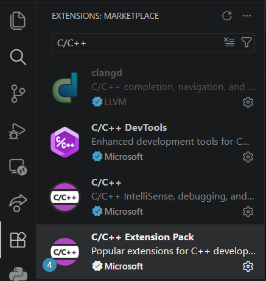
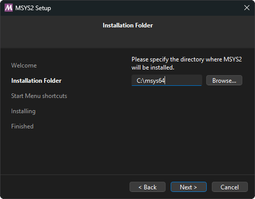
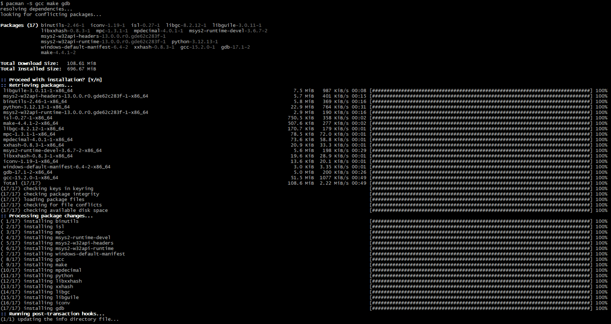
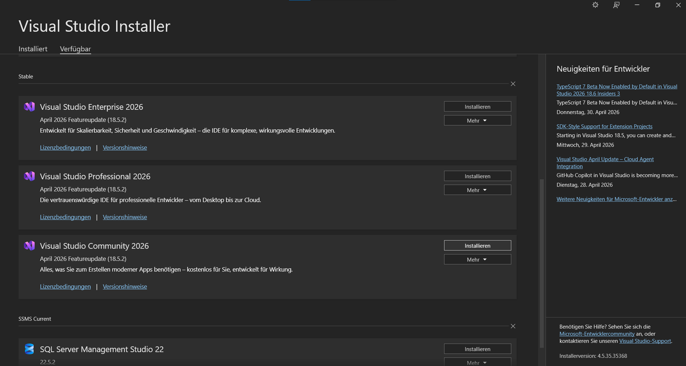
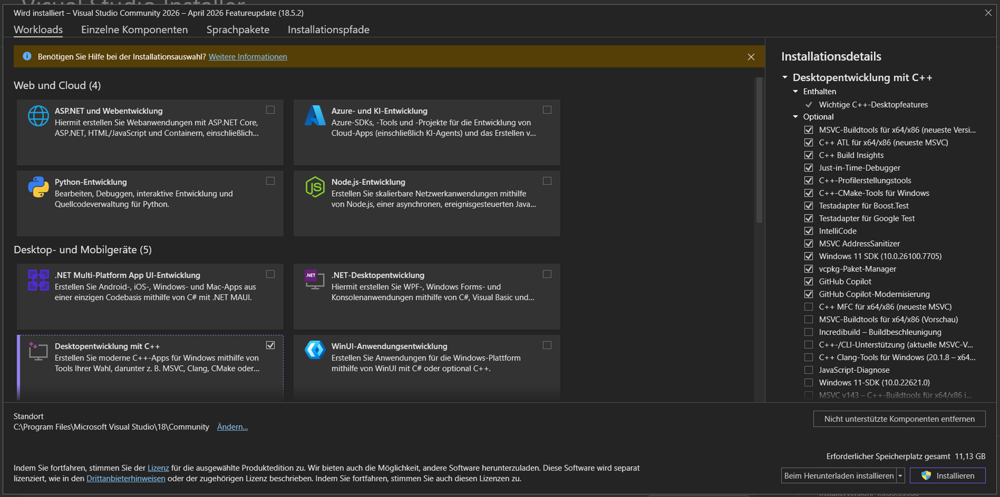

# Setup your IDE and Compiler

For these tutorials, you will need a code editor. While you could technically code in any kind of text editor, it is much nicer to use a proper IDE that gives you features like Syntax Highlighting. On top of this, we will need an actual compiler and other tools to build our applications.

There are multiple possible setups you can use for this tutorial, I will explain each one of them right here.

**Note that other setups do also work, and you are free to use them. These are the ones I recommend for this tutorial, however.**

***Once you are done with installation, try out [Exercise 0.1](https://github.com/Professor-Bavario/0.1-Our-first-C-Program) to see if you were successful!***

## First step: Pick your IDE
*If you chose Option 3 for Windows, please do not follow this part and instead jump ahead [here](#option-3---visual-studio-windows).*

For this tutorial we will be using [Visual Studio Code](https://code.visualstudio.com/) (or VS Code for short). It was made at Microsoft and is completely [open-source](https://github.com/microsoft/vscode).

Don't get that confused with *Visual Studio* which is used in option 2. That was also made by Microsoft, but is *closed-source* and works differently.

I have also heard that [VSCodium](https://vscodium.com/) exists, which gets rid of Microsoft's telemetry. I have never used VSCodium, but if you want to use it, it shouldn't be any different to use.

**Installing is quite simple:**
1. Download VS Code from [here](https://code.visualstudio.com/Download) and install it. If you are using certain Linux distros, you might need to use your package manager to install the package `code`.
2. Once you have it installed, head into the Extensions tab and search for `C/C++`. You should come across this extension pack:


3. Install this extension to give you syntax highlighting and IntelliSense features (to essentially make it nicer to work with).
4. If you're on Windows: Continue with Option 1 or Option 2.
If you're on Linux: Congrats, you're done!

## Windows Option 1 - MSYS2/MinGW (RECOMMENDED)
[MSYS2](https://www.msys2.org/) is a collection of compilers and tools that were originally made for Linux, but that were ported to Windows.

Using these tools, you can build your application with C or C++ natively on Windows.

To set it up, simply install MSYS2 from [here](https://www.msys2.org/#installation).

**Make sure it is installed into the `C:\msys64` folder and nowhere else!**


Once it is installed, its command line will pop up. In this command line, run this command:
```
pacman -S mingw-w64-ucrt-x86_64-gcc make gdb
```
When asked whether you want to continue installing the packages, hit Enter.

It should look something like this:


And that's it!

## Windows Option 2 - Windows Subsystem for Linux
Another option is to use the Linux tools directly through the [Windows Subsystem for Linux (WSL)](https://github.com/microsoft/WSL).

This will install a version of Linux onto your computer that you can use straight from Windows.

**Note that this means for this tutorial that you are effectively running on Linux, not Windows. Any Windows-specific exercises will not work for you.**

To install it, follow [this installation guide](learn.microsoft.com/en-us/windows/wsl/install) by Microsoft. Doing this installs Ubuntu onto your machine.

From there, run wsl using the command `wsl` in your command line, and in it run this command:
```
sudo apt install gcc make gdb
```
When asked whether you want to continue installing the packages, hit Enter.

And that's it!

## Windows Option 3 - Visual Studio
[Visual Studio](https://visualstudio.microsoft.com/) is a program made by Microsoft that allows you to code with multiple different languages natively on Windows, including C and C++. This is the official way to develop programs on Windows.

**One downside is that this program is very resource hungry. Installing it for C/C++ development makes it take up around 11 GB of size.**

To get started, install the Visual Studio Installer from [here](https://visualstudio.microsoft.com/de/downloads/). *Yes, you have to install an installer that installs the program. The Comedy is real.*

Once open, you will see multiple versions of VS available. Pick any of the Community versions:


From there, you will be given a plethora of options on the tools you want to install. Pick the C/C++ for desktop applications toolkit:


Now simply wait for VS to be installed and you're good to go!
